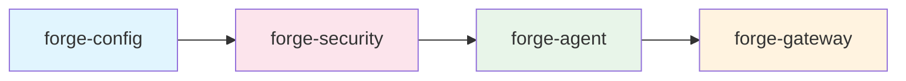
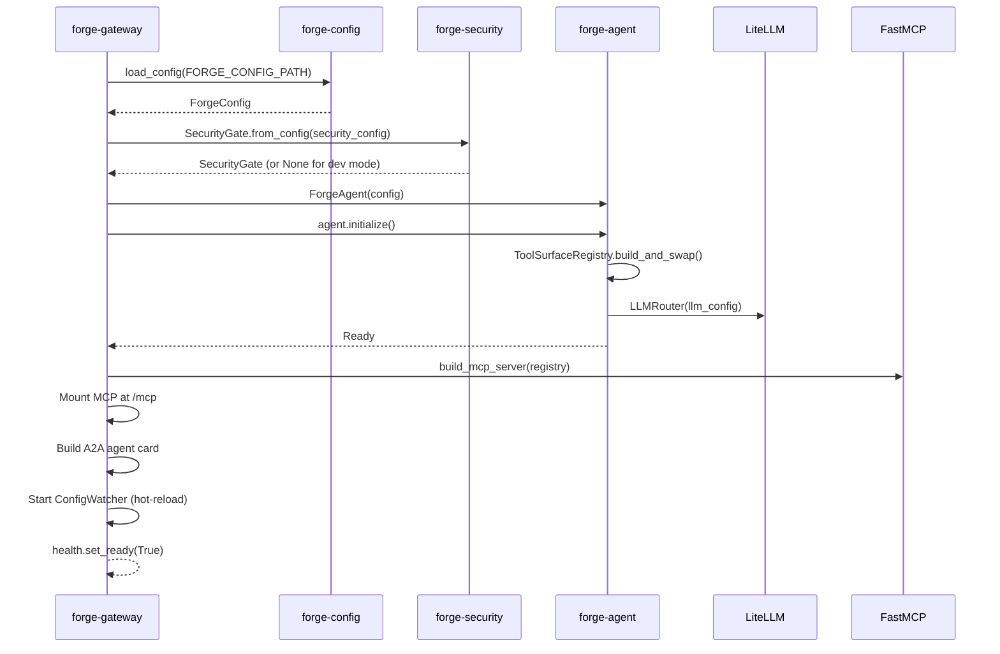
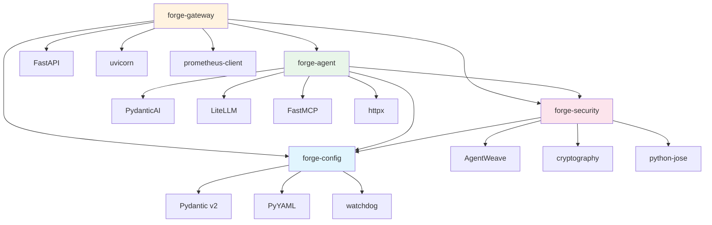

# Architecture

Forge AI is a config-driven AI agent system built as a uv monorepo workspace with four Python packages and one React frontend package. Configuration in `forge.yaml` drives every aspect of the system -- from LLM model selection and tool surface construction to security policy enforcement and multi-protocol exposure.

## Package Dependency Chain

The four Python packages form a strict, linear dependency chain:



Each package depends only on the packages to its left. This enforces a clean separation of concerns and prevents circular dependencies.

| Package | Description | Key Dependencies |
|---------|-------------|-----------------|
| **forge-config** | Pydantic v2 schema, YAML loader, hot-reload watcher, secret resolution | pydantic, pyyaml, watchdog |
| **forge-security** | AgentWeave integration for identity, signing, audit, rate limiting, trust policy | forge-config, agentweave, cryptography, python-jose |
| **forge-agent** | Tool builders (OpenAPI, manual, workflow) and PydanticAI agent core | forge-config, forge-security, pydantic-ai, litellm, fastmcp, httpx |
| **forge-gateway** | FastAPI application exposing REST, MCP, A2A interfaces and serving the React SPA | forge-config, forge-security, forge-agent, fastapi, uvicorn, prometheus-client |

The frontend package **forge-ui** (React 19 + TypeScript + Vite 6) is built separately and served as static files by the gateway.

## Component Breakdown

### forge-config

Owns the entire configuration surface. Every other package imports `ForgeConfig` from here.

| Module | Responsibility |
|--------|---------------|
| `schema.py` | Pydantic v2 models for `forge.yaml`: `ForgeConfig`, `LLMConfig`, `ToolsConfig`, `SecurityConfig`, `AgentsConfig`, and all nested types |
| `loader.py` | YAML parsing with `${VAR}` and `${VAR:default}` environment variable substitution |
| `secret_resolver.py` | `CompositeSecretResolver` that resolves `SecretRef` values from environment variables or Kubernetes secrets |
| `watcher.py` | `ConfigWatcher` using watchdog with debounced callbacks for hot-reload |
| `versioning.py` | Config version tracking |
| `exceptions.py` | `ConfigLoadError`, `ConfigValidationError`, `SecretResolutionError` |

**Source**: `packages/forge-config/src/forge_config/`

### forge-security

Wraps the AgentWeave framework into Forge-specific abstractions.

| Module | Responsibility |
|--------|---------------|
| `middleware.py` | `SecurityGate` -- the central authentication/authorization pipeline. Composes identity verification, trust policy, rate limiting, and audit into a single async callable that returns `GateResult` |
| `identity.py` | `ForgeIdentityManager` and `ForgeKeypair` for SPIFFE-based identity |
| `signing.py` | `MessageSigner` for cryptographic message signing with `SignedMessage` output |
| `audit.py` | `AuditLogger` emitting structured `ToolCallEvent` records |
| `rate_limit.py` | `SlidingWindowRateLimiter` for per-caller rate limiting |
| `trust.py` | `TrustPolicyEnforcer` evaluating origin-based trust with `PolicyDecision` |
| `secrets.py` | `K8sSecretResolver` and `ForgeCompositeSecretResolver` |

**Source**: `packages/forge-security/src/forge_security/`

### forge-agent

Builds the tool surface from configuration and runs agent interactions via PydanticAI.

| Module | Responsibility |
|--------|---------------|
| `agent/core.py` | `ForgeAgent` -- the main orchestrator. Accepts `ForgeConfig`, builds tools, creates PydanticAI agents, and provides `run_conversational()` and `run_structured()` methods |
| `agent/llm.py` | `LLMRouter` -- configures LiteLLM routing (embedded, sidecar, or external mode) |
| `agent/context.py` | `ConversationContext` -- session-scoped message history storage |
| `agent/peers.py` | `PeerCaller` -- makes A2A calls to peer Forge instances |
| `builder/registry.py` | `ToolSurfaceRegistry` -- collects tools from all builders, supports atomic swap on config reload |
| `builder/openapi.py` | `OpenAPIToolBuilder` -- generates PydanticAI tools from OpenAPI specs |
| `builder/manual.py` | `ManualToolBuilder` -- generates tools from manual definitions in config |
| `builder/workflow.py` | `WorkflowBuilder` -- generates composite multi-step workflow tools |

**Source**: `packages/forge-agent/src/forge_agent/`

### forge-gateway

The FastAPI application that ties everything together and serves both the API and the admin UI.

| Module | Responsibility |
|--------|---------------|
| `app.py` | Application factory (`create_app`), lifespan management, config hot-reload wiring, CORS, SPA static file serving |
| `auth.py` | `require_admin_key` dependency -- validates Bearer tokens or X-API-Key headers for admin routes. Includes SSRF protection for peer endpoints |
| `security.py` | `security_dependency` -- wraps `SecurityGate` into a FastAPI dependency for agent-facing routes. Falls back to dev mode when security is not configured |
| `models.py` | Request/response Pydantic models for all endpoints |
| `schema.py` | JSON Schema to Pydantic model converter for dynamic output schemas |
| `routes/health.py` | Liveness, readiness, and startup probes |
| `routes/admin.py` | Config management, tool listing/preview, session management, peer status |
| `routes/programmatic.py` | `POST /v1/agent/invoke` -- structured agent invocation |
| `routes/conversational.py` | `POST /v1/chat/completions` -- conversational chat with optional SSE streaming |
| `routes/a2a.py` | A2A protocol endpoints -- agent card discovery and task submission |
| `routes/mcp.py` | FastMCP server construction and ASGI mount |
| `routes/metrics.py` | Prometheus metrics endpoint |
| `middleware/logging.py` | Request logging middleware |

**Source**: `packages/forge-gateway/src/forge_gateway/`

### forge-ui

React admin dashboard for managing Forge instances.

| Technology | Version |
|-----------|---------|
| React | 19 |
| TypeScript | 5.7 |
| Vite | 6 |
| Tailwind CSS | 4 |
| Zustand | 5 (state management) |
| TanStack Query | 5 (data fetching) |
| CodeMirror | 6 (YAML/JSON editing) |
| React Router | 7 (client-side routing) |

**Source**: `packages/forge-ui/`

## Data Flow

The system initializes in a strict sequence during the gateway's lifespan:



### Hot-Reload Flow

When `forge.yaml` is modified on disk:

1. `ConfigWatcher` detects the change (debounced at 1 second)
2. `load_config()` re-parses and validates the YAML
3. Admin state, API key auth, and `SecurityGate` are updated synchronously
4. Tool surface rebuild and MCP server reconstruction are scheduled as async tasks
5. The A2A agent card is refreshed

## Directory Structure

```
forge-ai/
├── pyproject.toml                 # Workspace root: uv, ruff, mypy, pytest config
├── uv.lock                       # Locked dependency versions
├── forge.yaml.example            # Canonical config reference
├── Dockerfile                    # Multi-stage build (Node → Python → runtime)
├── docker-compose.yaml           # Local development with Redis
├── skaffold.yaml                 # Kubernetes development workflow
├── packages/
│   ├── forge-config/
│   │   ├── pyproject.toml
│   │   ├── src/forge_config/     # Schema, loader, watcher, secrets
│   │   └── tests/                # Unit tests
│   ├── forge-security/
│   │   ├── pyproject.toml
│   │   ├── src/forge_security/   # SecurityGate, identity, signing, audit
│   │   └── tests/
│   ├── forge-agent/
│   │   ├── pyproject.toml
│   │   ├── src/forge_agent/
│   │   │   ├── agent/            # Core, LLM router, context, peers
│   │   │   └── builder/          # OpenAPI, manual, workflow tool builders
│   │   └── tests/
│   ├── forge-gateway/
│   │   ├── pyproject.toml
│   │   ├── src/forge_gateway/
│   │   │   ├── routes/           # health, admin, programmatic, conversational, a2a, mcp, metrics
│   │   │   └── middleware/       # Request logging
│   │   └── tests/
│   └── forge-ui/
│       ├── package.json          # React 19 + Vite 6 + Tailwind 4
│       ├── src/                  # TypeScript source
│       └── vite.config.ts        # Dev server with API proxy
├── e2e-tests/                    # End-to-end tests (httpx + Playwright)
├── deploy/
│   └── helm/forge/               # Helm chart with sizing profiles
├── vendor/
│   └── agentweave/               # AgentWeave security framework
└── docs/                         # Jekyll documentation site
```

## External Dependency Graph



| Dependency | Why It Is Used |
|-----------|---------------|
| **Pydantic v2** | Data validation and serialization for all config models and API request/response types |
| **PydanticAI** | Agent framework providing tool registration, structured output, streaming, and multi-model support |
| **LiteLLM** | Unified LLM routing -- abstracts OpenAI, Anthropic, and other providers behind a single interface. Supports embedded, sidecar, and external proxy modes |
| **FastMCP** | Builds MCP (Model Context Protocol) tool surfaces from the agent's tool registry |
| **AgentWeave** | Security framework providing SPIFFE-based identity, message signing, OPA authorization, and audit logging |
| **FastAPI** | HTTP framework for the gateway -- provides OpenAPI docs, dependency injection, and ASGI compatibility |
| **watchdog** | File system event monitoring for config hot-reload |
| **httpx** | Async HTTP client used for OpenAPI spec fetching, peer communication, and API tool calls |

## Design Decisions

### Async-First

All I/O operations are async. The gateway runs on uvicorn (ASGI), the agent uses `async/await` for LLM calls and tool execution, and the security gate pipeline is fully async. This allows high concurrency without thread pool overhead.

### Config-Driven

The system is driven entirely by `forge.yaml`. There is no imperative tool registration API -- tools are declared in config and the tool surface is built automatically at startup. Config changes trigger a hot-reload that atomically swaps the tool registry without downtime.

### Pydantic v2 Everywhere

Every data boundary uses Pydantic v2: configuration schema, API request/response models, tool parameter definitions, and security config. This provides runtime validation, JSON Schema generation, and serialization in a single abstraction.

### Monorepo Workspace

The uv workspace structure allows each package to be developed and tested independently while sharing a single lockfile and virtual environment. The strict dependency chain (`config -> security -> agent -> gateway`) prevents architectural violations.

### Multi-Protocol Exposure

The same agent and tool surface is exposed through three protocols simultaneously:

- **REST** -- Traditional HTTP API for programmatic and conversational use
- **MCP** -- Model Context Protocol for LLM-to-LLM tool discovery
- **A2A** -- Agent-to-Agent protocol for peer communication between Forge instances
