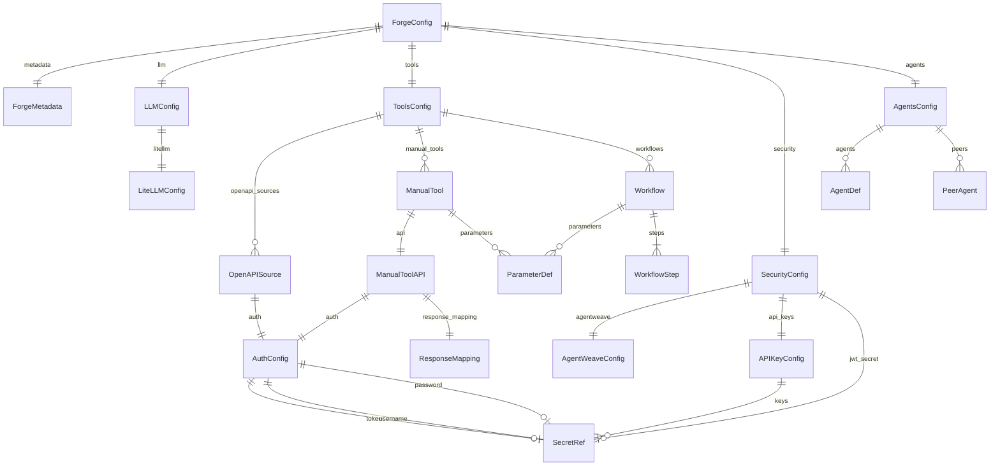
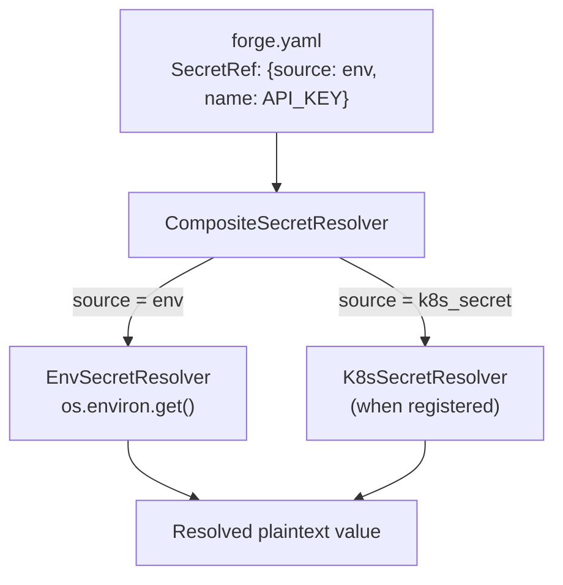

# Data Model

All Forge AI configuration is defined through a hierarchy of Pydantic v2 models rooted at `ForgeConfig`. The schema is defined in `packages/forge-config/src/forge_config/schema.py`.

## ForgeConfig Schema

### Root Model

```python
class ForgeConfig(BaseModel):
    metadata: ForgeMetadata
    llm: LLMConfig
    tools: ToolsConfig
    security: SecurityConfig
    agents: AgentsConfig
```

All fields have defaults, so an empty `forge.yaml` file is valid and produces a working (minimal) configuration.

### Model Hierarchy



## Model Definitions

### Metadata

| Field | Type | Default | Description |
|-------|------|---------|-------------|
| `name` | `str` | `"forge"` | Deployment name |
| `version` | `str` | `"0.1.0"` | Config version |
| `description` | `str` | `""` | Human-readable description |
| `environment` | `str` | `"development"` | Environment identifier (development, staging, production) |

### LLM Configuration

**`LLMConfig`**

| Field | Type | Default | Description |
|-------|------|---------|-------------|
| `default_model` | `str` | `"gpt-4o"` | Default LLM model identifier |
| `temperature` | `float` | `0.7` | Sampling temperature |
| `max_tokens` | `int` | `4096` | Maximum response tokens |
| `system_prompt` | `str \| None` | `None` | Default system prompt for all agents |
| `litellm` | `LiteLLMConfig` | (defaults) | LiteLLM router configuration |

**`LiteLLMConfig`**

| Field | Type | Default | Validation |
|-------|------|---------|------------|
| `mode` | `LiteLLMMode` | `embedded` | One of: `embedded`, `sidecar`, `external` |
| `endpoint` | `str \| None` | `None` | Required when mode is `sidecar` or `external` |
| `model_list` | `list[dict]` | `[]` | LiteLLM model routing table |
| `fallback_models` | `list[str]` | `[]` | Fallback model chain |
| `timeout` | `float` | `30.0` | Request timeout in seconds |
| `max_retries` | `int` | `3` | Maximum retry attempts |

### Tools Configuration

**`ToolsConfig`**

| Field | Type | Default | Description |
|-------|------|---------|-------------|
| `openapi_sources` | `list[OpenAPISource]` | `[]` | OpenAPI specs to auto-generate tools from |
| `manual_tools` | `list[ManualTool]` | `[]` | Manually defined API tools |
| `workflows` | `list[Workflow]` | `[]` | Composite multi-step tools |

Backward-compatible aliases: `openapi` maps to `openapi_sources`, `manual` maps to `manual_tools`.

**`OpenAPISource`**

| Field | Type | Default | Validation |
|-------|------|---------|------------|
| `name` | `str` | (required) | Source identifier |
| `url` | `str \| None` | `None` | Remote spec URL |
| `path` | `str \| None` | `None` | Local file path |
| `spec` | `str \| None` | `None` | Auto-resolves to `url` or `path` |
| `route_map` | `dict[str, str]` | `{}` | Operation ID to tool name mapping |
| `auth` | `AuthConfig` | (defaults) | Auth for API calls |
| `prefix` | `str \| None` | `None` | Tool name prefix |
| `namespace` | `str \| None` | `None` | Synced with `prefix` |
| `include_tags` | `list[str]` | `[]` | Filter by OpenAPI tags |
| `include_operations` | `list[str]` | `[]` | Filter by operation IDs |

At least one of `url`, `path`, or `spec` must be provided.

**`ManualTool`**

| Field | Type | Default | Description |
|-------|------|---------|-------------|
| `name` | `str` | (required) | Tool name |
| `description` | `str` | (required) | Tool description for LLM |
| `parameters` | `list[ParameterDef]` | `[]` | Input parameters |
| `api` | `ManualToolAPI` | (required) | API call configuration |

**`ManualToolAPI`**

| Field | Type | Default | Validation |
|-------|------|---------|------------|
| `url` | `str \| None` | `None` | Full URL |
| `base_url` | `str \| None` | `None` | Base URL (combined with `endpoint`) |
| `endpoint` | `str \| None` | `None` | Path appended to `base_url` |
| `method` | `HTTPMethod` | `GET` | One of: `GET`, `POST`, `PUT`, `PATCH`, `DELETE` |
| `headers` | `dict[str, str]` | `{}` | Additional HTTP headers |
| `body_template` | `dict \| None` | `None` | Request body template |
| `auth` | `AuthConfig` | (defaults) | Authentication config |
| `response_mapping` | `ResponseMapping` | (defaults) | Response field mapping |
| `timeout` | `float` | `30.0` | Request timeout |

Either `url` or both `base_url` and `endpoint` must be provided.

**`ParameterDef`**

| Field | Type | Default | Description |
|-------|------|---------|-------------|
| `name` | `str` | (required) | Parameter name |
| `type` | `ParamType` | `string` | One of: `string`, `integer`, `number`, `boolean`, `array`, `object` |
| `description` | `str` | `""` | Parameter description |
| `required` | `bool` | `True` | Whether the parameter is required |
| `default` | `Any` | `None` | Default value |

**`Workflow` and `WorkflowStep`**

| Field | Type | Default | Description |
|-------|------|---------|-------------|
| `name` | `str` | (required) | Workflow tool name |
| `description` | `str` | (required) | Workflow description |
| `parameters` | `list[ParameterDef]` | `[]` | Input parameters |
| `steps` | `list[WorkflowStep]` | (required, min 1) | Ordered execution steps |

| WorkflowStep Field | Type | Default | Description |
|---------------------|------|---------|-------------|
| `tool` | `str` | (required) | Name of tool to invoke |
| `params` | `dict[str, Any]` | `{}` | Parameters (supports `{{ var }}` templates) |
| `output_as` | `str \| None` | `None` | Variable name for step output |
| `condition` | `str \| None` | `None` | Condition expression for conditional execution |

### Authentication Configuration

**`AuthConfig`**

| Field | Type | Default | Description |
|-------|------|---------|-------------|
| `type` | `AuthType` | `none` | One of: `bearer`, `api_key`, `basic`, `none` |
| `token` | `SecretRef \| None` | `None` | Required for `bearer` and `api_key` |
| `header_name` | `str` | `"Authorization"` | Header name for API key auth |
| `username` | `SecretRef \| None` | `None` | Required for `basic` auth |
| `password` | `SecretRef \| None` | `None` | Required for `basic` auth |

### Security Configuration

**`SecurityConfig`**

| Field | Type | Default | Description |
|-------|------|---------|-------------|
| `agentweave` | `AgentWeaveConfig` | (defaults) | AgentWeave integration |
| `api_keys` | `APIKeyConfig` | (defaults) | Admin API key auth |
| `jwt_secret` | `SecretRef \| None` | `None` | Secret for JWT verification |
| `rate_limit_rpm` | `int` | `60` | Requests per minute per caller |
| `allowed_origins` | `list[str]` | `["*"]` | CORS allowed origins |

**`AgentWeaveConfig`**

| Field | Type | Default | Description |
|-------|------|---------|-------------|
| `enabled` | `bool` | `True` | Enable AgentWeave security |
| `trust_domain` | `str` | `"forge.local"` | SPIFFE trust domain |
| `spiffe_endpoint` | `str` | `"unix:///run/spire/sockets/agent.sock"` | SPIRE agent socket |
| `authz_provider` | `str` | `"opa"` | Authorization provider |
| `opa_endpoint` | `str` | `"http://localhost:8181"` | OPA endpoint |
| `identity_secret` | `str \| None` | `None` | Identity secret override |
| `trust_policy` | `TrustPolicy` | `strict` | One of: `strict`, `permissive` |

**`APIKeyConfig`**

| Field | Type | Default | Description |
|-------|------|---------|-------------|
| `enabled` | `bool` | `False` | Enable API key authentication |
| `keys` | `list[SecretRef]` | `[]` | List of API key secret references |

### Agents Configuration

**`AgentsConfig`**

| Field | Type | Default | Description |
|-------|------|---------|-------------|
| `default` | `str` | `"assistant"` | Name of the default agent persona |
| `agents` | `list[AgentDef]` | `[]` | Named agent persona definitions |
| `peers` | `list[PeerAgent]` | `[]` | Peer agent connections |

**`AgentDef`**

| Field | Type | Default | Description |
|-------|------|---------|-------------|
| `name` | `str` | (required) | Agent persona name |
| `description` | `str` | `""` | Human-readable description |
| `system_prompt` | `str \| None` | `None` | System prompt override |
| `model` | `str \| None` | `None` | Model override (uses default if None) |
| `tools` | `list[str]` | `[]` | Tool name allow-list (empty = all tools) |
| `max_turns` | `int` | `10` | Maximum LLM request turns |

**`PeerAgent`**

| Field | Type | Default | Description |
|-------|------|---------|-------------|
| `name` | `str` | (required) | Peer identifier |
| `endpoint` | `str` | (required) | Peer base URL |
| `trust_level` | `TrustLevel` | `low` | One of: `high`, `medium`, `low` |
| `capabilities` | `list[str]` | `[]` | Peer's declared capabilities |

### Secret References

**`SecretRef`**

| Field | Type | Default | Validation |
|-------|------|---------|------------|
| `source` | `SecretSource` | (required) | One of: `env`, `k8s_secret` |
| `name` | `str` | (required) | Environment variable name or K8s secret name |
| `key` | `str \| None` | `None` | Required when `source` is `k8s_secret` |

## Configuration File Format

Configuration is defined in `forge.yaml` (path configurable via `FORGE_CONFIG_PATH` environment variable). Here is a minimal example:

```yaml
metadata:
  name: my-forge-agent
  environment: development

llm:
  default_model: gpt-4o
  temperature: 0.7
  max_tokens: 4096
  litellm:
    mode: embedded

tools:
  manual_tools:
    - name: get_weather
      description: "Get current weather for a location"
      parameters:
        - name: location
          type: string
          required: true
      api:
        base_url: "https://api.weatherapi.com"
        endpoint: "/v1/current.json"
        method: GET
        auth:
          type: api_key
          token:
            source: env
            name: WEATHER_API_KEY

security:
  api_keys:
    enabled: true
    keys:
      - source: env
        name: FORGE_API_KEY
  rate_limit_rpm: 60
  allowed_origins:
    - "*"

agents:
  default: assistant
  agents:
    - name: assistant
      description: "General-purpose assistant"
      max_turns: 10
```

The canonical reference with all options is in `forge.yaml.example` at the repository root.

## Secret Resolution Flow

Secrets are never stored as plaintext in the configuration file. Instead, they are referenced using `SecretRef` objects that are resolved at runtime:



The `CompositeSecretResolver` delegates to source-specific resolvers:

- **`EnvSecretResolver`** -- Reads from environment variables (`os.environ.get(ref.name)`)
- **`K8sSecretResolver`** -- Reads from Kubernetes secret volumes (registered when running in-cluster)

If resolution fails, a `SecretResolutionError` is raised with a descriptive message. The admin API recursively redacts all `SecretRef` values before returning configuration data to prevent secret leakage.

**Source:** `packages/forge-config/src/forge_config/secret_resolver.py`
