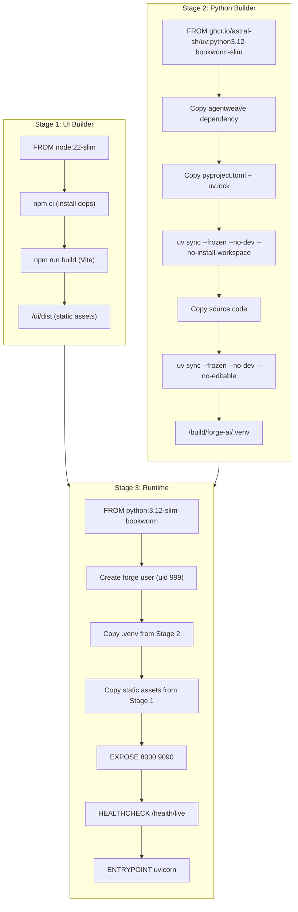
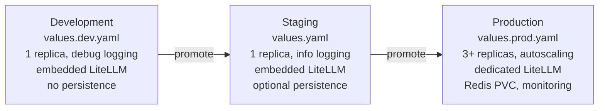

# Infrastructure

## Docker Multi-Stage Build

The `Dockerfile` uses a three-stage build to produce a minimal runtime image targeting less than 200MB.



### Build Details

| Stage | Base Image | Purpose | Output |
|-------|-----------|---------|--------|
| UI Builder | `node:22-slim` | Build React SPA with Vite | `/ui/dist` (static HTML/JS/CSS) |
| Python Builder | `ghcr.io/astral-sh/uv:python3.12-bookworm-slim` | Install Python dependencies and workspace packages | `/build/forge-ai/.venv` |
| Runtime | `python:3.12-slim-bookworm` | Minimal production image | Port 8000 (HTTP) + 9090 (metrics) |

### Build Context

The Dockerfile expects to be built from the **parent directory** of the forge-ai repository because AgentWeave is referenced as a sibling:

```bash
# Build from parent directory
docker build -f forge-ai/Dockerfile .
```

### Security Hardening

- Runs as non-root user `forge` (UID 999, GID 999)
- `PYTHONUNBUFFERED=1` for reliable logging
- `PYTHONDONTWRITEBYTECODE=1` to prevent `.pyc` file creation
- uv cache mount (`--mount=type=cache`) avoids embedding cache in layers

### HEALTHCHECK

```dockerfile
HEALTHCHECK --interval=30s --timeout=5s --start-period=10s --retries=3 \
    CMD ["python", "-c", "import httpx; httpx.get('http://localhost:8000/health/live').raise_for_status()"]
```

**Source:** `Dockerfile`

## Helm Chart Structure

The Helm chart at `deploy/helm/forge/` provides a complete Kubernetes deployment with configurable profiles.

```
deploy/helm/forge/
  Chart.yaml              # Chart metadata (v0.1.0)
  values.yaml             # Default values (small profile)
  values.dev.yaml         # Development overrides
  values.prod.yaml        # Production overrides (large profile)
  templates/
    _helpers.tpl           # Template helper functions
    deployment.yaml        # Agent deployment
    gateway-deployment.yaml # Separate gateway (large profile)
    litellm-deployment.yaml # LiteLLM sidecar/dedicated
    redis-deployment.yaml  # Redis + Service + PVC
    service.yaml           # ClusterIP service
    ingress.yaml           # Ingress resource
    configmap.yaml         # forge.yaml ConfigMap
    secret.yaml            # API key secrets
    hpa.yaml               # Horizontal Pod Autoscaler
    pdb.yaml               # Pod Disruption Budget
    servicemonitor.yaml    # Prometheus ServiceMonitor
    NOTES.txt              # Post-install notes
```

## Deployment Profiles

### Profile Comparison

| Setting | Small (dev) | Medium (default) | Large (prod) |
|---------|-------------|------------------|--------------|
| **Agent replicas** | 1 | 1 | 3 |
| **Agent CPU request** | 50m | 100m | 500m |
| **Agent memory request** | 64Mi | 128Mi | 512Mi |
| **Agent CPU limit** | 500m | 500m | 2000m |
| **Agent memory limit** | 512Mi | 512Mi | 2Gi |
| **Gateway** | disabled (in-process) | disabled (in-process) | enabled (2 replicas) |
| **Gateway CPU request** | -- | -- | 250m |
| **Gateway memory request** | -- | -- | 256Mi |
| **LiteLLM mode** | embedded | embedded | dedicated |
| **Redis persistence** | disabled | disabled | enabled (5Gi PVC) |
| **Autoscaling** | disabled | disabled | enabled (3-20 replicas) |
| **HPA CPU target** | -- | -- | 60% |
| **Pod Disruption Budget** | disabled | disabled | enabled (min 2) |
| **ServiceMonitor** | disabled | disabled | enabled |

### Profile Usage

```bash
# Development
helm install forge ./deploy/helm/forge -f deploy/helm/forge/values.dev.yaml

# Production
helm install forge ./deploy/helm/forge -f deploy/helm/forge/values.prod.yaml

# Custom config
helm install forge ./deploy/helm/forge \
  --set-file forgeConfig=my-forge.yaml \
  --set secrets.OPENAI_API_KEY="sk-..."
```

## Kubernetes Resources

### Deployment (Agent)

The primary deployment runs the Forge agent container with:

- **Config volume mount:** ConfigMap mounted at `/app/config/forge.yaml`
- **Environment:** `FORGE_CONFIG_PATH=/app/config/forge.yaml`
- **Security context:** `runAsNonRoot: true`, UID/GID 999
- **Config checksum annotation:** Forces pod restart on ConfigMap changes
- **Optional LiteLLM sidecar:** When `litellm.mode=sidecar`, a LiteLLM container runs alongside the agent on port 4000

**Source:** `deploy/helm/forge/templates/deployment.yaml`

### Service

```yaml
type: ClusterIP
ports:
  - port: 8000    # HTTP (gateway/agent)
    name: http
  - port: 9090    # Prometheus metrics
    name: metrics
```

The service selector dynamically targets either the `gateway` component (when gateway is enabled) or the `agent` component (when gateway is in-process).

**Source:** `deploy/helm/forge/templates/service.yaml`

### Ingress

Optional Ingress resource with configurable:
- `ingressClassName` (e.g., `nginx`)
- Host-based routing
- TLS termination
- Custom annotations

**Source:** `deploy/helm/forge/templates/ingress.yaml`

### ConfigMap

Embeds the full `forge.yaml` content from `values.forgeConfig`. When no custom config is provided, generates a minimal default config using the chart name and profile.

**Source:** `deploy/helm/forge/templates/configmap.yaml`

### HPA (Horizontal Pod Autoscaler)

When `autoscaling.enabled=true`:

```yaml
apiVersion: autoscaling/v2
scaleTargetRef: Deployment/{name}-agent
minReplicas: 3      # (prod default)
maxReplicas: 20     # (prod default)
metrics:
  - type: Resource
    resource: cpu
    target: 60%     # (prod default)
```

**Source:** `deploy/helm/forge/templates/hpa.yaml`

### Redis

The Redis deployment supports four modes:

| Mode | Description |
|------|-------------|
| `single` | Single Redis pod without persistence |
| `single-pvc` | Single Redis pod with PersistentVolumeClaim |
| `ha` | High-availability (reserved for future implementation) |
| `external` | Skip deployment, use external Redis (configure `redis.external.host`) |

When persistence is enabled, a `PersistentVolumeClaim` is created with configurable `size` and `storageClass`.

**Source:** `deploy/helm/forge/templates/redis-deployment.yaml`

## Environment Promotion



### Development Environment

- `image.pullPolicy: Never` (local images)
- `FORGE_ENV=development`, `LOG_LEVEL=DEBUG`
- Minimal resource requests (50m CPU, 64Mi memory)

### Production Environment

- 3 agent replicas with autoscaling (3-20)
- Separate gateway deployment (2 replicas)
- Dedicated LiteLLM service
- Redis with 5Gi persistent storage
- ServiceMonitor for Prometheus
- Pod Disruption Budget (min 2 available)

**Source:** `deploy/helm/forge/values.dev.yaml`, `deploy/helm/forge/values.prod.yaml`
