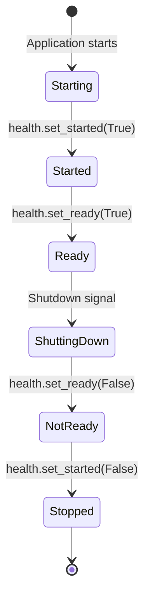
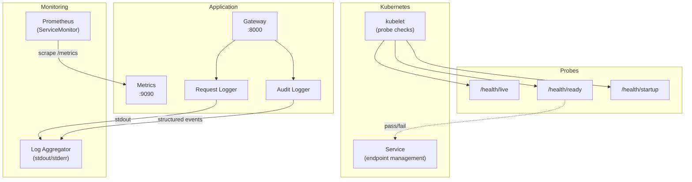

# Monitoring

## Health Probes

Forge AI exposes three Kubernetes-style health endpoints, each reflecting a distinct aspect of application readiness:

| Endpoint | Purpose | Healthy Response | Unhealthy Response |
|----------|---------|-----------------|-------------------|
| `GET /health/live` | Liveness check -- is the process running? | `200 {"status": "ok"}` | (never fails if the process is up) |
| `GET /health/ready` | Readiness check -- is the application ready to serve traffic? | `200 {"status": "ready"}` | `503 {"detail": "Not ready"}` |
| `GET /health/startup` | Startup check -- has initial startup completed? | `200 {"status": "started"}` | `503 {"detail": "Starting up"}` |

### State Transitions



The state flags are set during the FastAPI lifespan context manager:

1. **Startup:** `set_started(True)` is called immediately when the lifespan begins
2. **Ready:** `set_ready(True)` is called after config loading, agent initialization, tool surface building, MCP server mounting, and security gate initialization
3. **Shutdown:** `set_ready(False)` and `set_started(False)` are called in the `finally` block

**Source:** `packages/forge-gateway/src/forge_gateway/routes/health.py`, `packages/forge-gateway/src/forge_gateway/app.py` (lifespan)

## Prometheus Metrics

The `/metrics` endpoint exposes Prometheus-format metrics via the `prometheus_client` library:

```python
@router.get("/metrics", response_class=PlainTextResponse)
async def metrics() -> str:
    try:
        from prometheus_client import generate_latest
        return generate_latest().decode("utf-8")
    except ImportError:
        return "# prometheus_client not available\n"
```

The endpoint gracefully degrades when `prometheus_client` is not installed, returning a comment instead of failing.

**Source:** `packages/forge-gateway/src/forge_gateway/routes/metrics.py`

## Request Logging

The `RequestLoggingMiddleware` logs every HTTP request with method, path, status code, and duration:

```
INFO  forge.gateway  GET /health/live 200 0.001s
INFO  forge.gateway  POST /v1/chat 200 2.345s
INFO  forge.gateway  GET /v1/admin/config 401 0.002s
```

### Log Format

```
{method} {path} {status_code} {elapsed:.3f}s
```

The middleware uses `time.monotonic()` for accurate elapsed time measurement, unaffected by wall-clock adjustments.

### Log Level Configuration

The application log level is configurable via the `LOG_LEVEL` environment variable. In the development Helm values, this defaults to `DEBUG`:

```yaml
# values.dev.yaml
agent:
  env:
    - name: LOG_LEVEL
      value: DEBUG
```

### Logger Hierarchy

| Logger Name | Component |
|-------------|-----------|
| `forge.gateway` | Gateway application and request logging |
| `forge.gateway.auth` | Admin API key authentication |
| `forge.gateway.security` | SecurityGate dependency |
| `forge.gateway.admin` | Admin API routes |
| `forge.security.middleware` | SecurityGate pipeline |
| `forge_config.watcher` | Config file watcher |

**Source:** `packages/forge-gateway/src/forge_gateway/middleware/logging.py`

## Kubernetes Probe Configuration

The Helm chart configures all three probe types for the agent deployment:

### Liveness Probe

```yaml
livenessProbe:
  httpGet:
    path: /health/live
    port: http          # 8000
  initialDelaySeconds: 10
  periodSeconds: 30
```

Checks that the process is alive. A failure triggers a pod restart. The 10-second initial delay allows the application to start before probing begins.

### Readiness Probe

```yaml
readinessProbe:
  httpGet:
    path: /health/ready
    port: http          # 8000
  initialDelaySeconds: 5
  periodSeconds: 10
```

Checks that the application is ready to serve traffic. Pods that fail readiness are removed from the Service's endpoint list (no traffic routed to them) but are not restarted.

### Startup Probe

```yaml
startupProbe:
  httpGet:
    path: /health/startup
    port: http          # 8000
  failureThreshold: 30
  periodSeconds: 2
```

Provides a generous startup window (30 failures x 2 seconds = 60 seconds) for initial tool surface building and config loading. Once the startup probe succeeds, liveness and readiness probes take over.

### Redis Probes

Redis pods use `redis-cli ping` for both liveness and readiness:

```yaml
livenessProbe:
  exec:
    command: ["redis-cli", "ping"]
  periodSeconds: 10
readinessProbe:
  exec:
    command: ["redis-cli", "ping"]
  periodSeconds: 5
```

**Source:** `deploy/helm/forge/templates/deployment.yaml`, `deploy/helm/forge/templates/redis-deployment.yaml`

## Docker HEALTHCHECK

The Docker image includes a built-in health check independent of Kubernetes probes:

```dockerfile
HEALTHCHECK --interval=30s --timeout=5s --start-period=10s --retries=3 \
    CMD ["python", "-c", "import httpx; httpx.get('http://localhost:8000/health/live').raise_for_status()"]
```

| Parameter | Value | Description |
|-----------|-------|-------------|
| `interval` | 30s | Time between health checks |
| `timeout` | 5s | Maximum time for a single check |
| `start-period` | 10s | Grace period during startup |
| `retries` | 3 | Consecutive failures before marking unhealthy |

This health check is used when running the container outside of Kubernetes (e.g., `docker run`, Docker Compose).

**Source:** `Dockerfile`

## ServiceMonitor (Prometheus Operator)

When `serviceMonitor.enabled=true` (production profile), the Helm chart creates a `ServiceMonitor` resource for the Prometheus Operator:

```yaml
apiVersion: monitoring.coreos.com/v1
kind: ServiceMonitor
spec:
  selector:
    matchLabels:
      # forge selector labels
  endpoints:
    - port: metrics       # 9090
      interval: 30s
      scrapeTimeout: 10s
      path: /metrics
```

| Setting | Default | Description |
|---------|---------|-------------|
| `serviceMonitor.enabled` | `false` (default), `true` (prod) | Enable ServiceMonitor creation |
| `serviceMonitor.interval` | `30s` | Prometheus scrape interval |
| `serviceMonitor.scrapeTimeout` | `10s` | Maximum scrape duration |

The metrics endpoint runs on port 9090, which is exposed alongside the main HTTP port (8000) in the Service definition.

**Source:** `deploy/helm/forge/templates/servicemonitor.yaml`

## Observability Architecture


