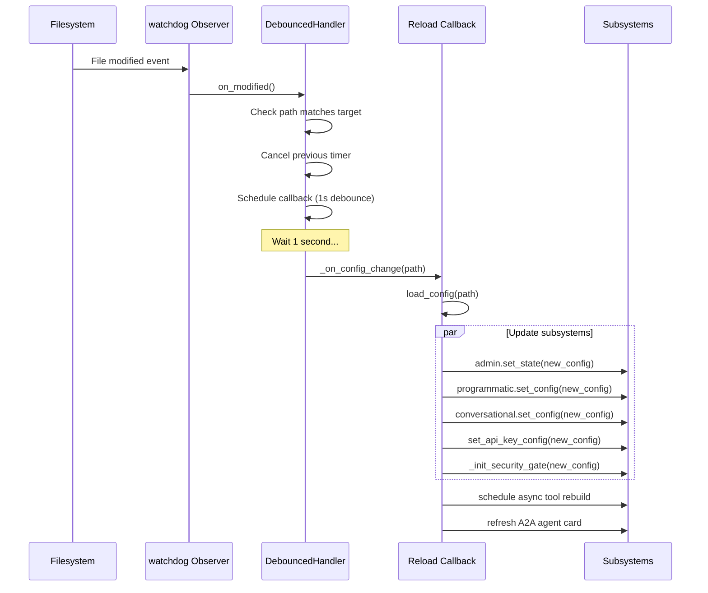
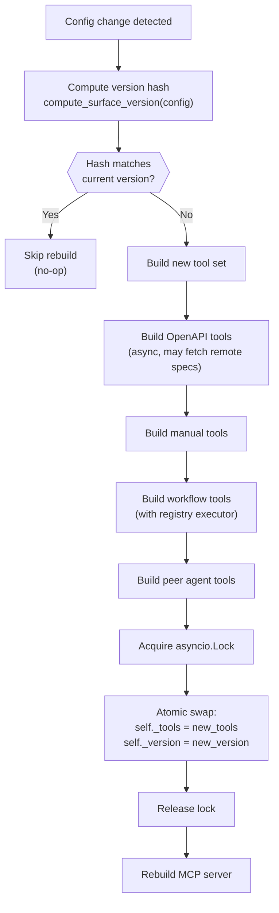
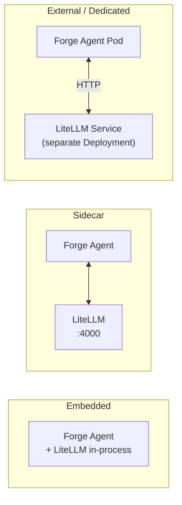

# Performance

## Async-First Architecture

All I/O operations in Forge AI use Python's `asyncio` framework. This design choice ensures the gateway can handle concurrent requests efficiently without thread-per-request overhead.

### Async Boundaries

| Component | Async Methods | Purpose |
|-----------|--------------|---------|
| `ForgeAgent` | `initialize()`, `run_conversational()`, `run_structured()` | Agent orchestration |
| `ToolSurfaceRegistry` | `build_and_swap()`, `force_swap()`, `clear()` | Atomic tool surface updates |
| `SecurityGate` | `__call__()`, `authenticate()`, `authorize_tool_call()`, `check_rate_limit()` | Security pipeline |
| `TrustPolicyEnforcer` | `evaluate()`, `check_origin()`, `check_rate_limit()` | Trust policy checks |
| `SlidingWindowRateLimiter` | `check()`, `peek()` | Rate limit checks |
| `AuditLogger` | `log_tool_call()` | Audit event recording |
| `OpenAPIToolBuilder` | `build()` | Remote spec fetching |
| All FastAPI routes | `async def` handlers | Request handling |

The gateway uses `uvicorn` as the ASGI server, configured via the Docker entrypoint:

```
python -m uvicorn forge_gateway.app:create_app --factory --host 0.0.0.0 --port 8000
```

**Source:** `packages/forge-agent/src/forge_agent/agent/core.py`, `Dockerfile`

## Config Hot-Reload

The `ConfigWatcher` monitors the `forge.yaml` file for changes using the `watchdog` library and triggers a reload cascade without restarting the application.

### Reload Flow



### Debounce Mechanism

The `_DebouncedHandler` prevents rapid file-change events (common with editors that perform multiple writes) from triggering excessive reloads. It uses `asyncio.AbstractEventLoop.call_later()` to schedule the callback after a 1-second quiet period. Each new event cancels the previous timer.

**Source:** `packages/forge-config/src/forge_config/watcher.py`

## Tool Registry Hot-Swap

The `ToolSurfaceRegistry` provides zero-downtime tool surface updates through atomic replacement.

### Hot-Swap Process



### Version-Based Change Detection

The registry uses a content hash (`compute_surface_version`) to detect whether the tool-related configuration has actually changed. If the hash matches the current version, the rebuild is skipped entirely. This prevents unnecessary work when non-tool config fields are modified.

### Concurrency Safety

All tool surface mutations are protected by an `asyncio.Lock`. This prevents concurrent config reloads from interleaving their build and swap operations. The lock is held only during the final swap (not during the build phase), minimizing contention.

**Source:** `packages/forge-agent/src/forge_agent/builder/registry.py`

## LiteLLM Modes

Forge AI supports three deployment modes for LiteLLM, each optimizing for different scale and isolation needs:

| Mode | Description | Use Case | Configuration |
|------|-------------|----------|---------------|
| **Embedded** | LiteLLM runs in-process within the Forge agent | Development, single-instance deployments | `litellm.mode: embedded` |
| **Sidecar** | LiteLLM runs as a separate container in the same pod | Medium scale, shared pod resources | `litellm.mode: sidecar`, requires `litellm.endpoint` |
| **External** | LiteLLM runs as a dedicated Kubernetes service | Production, independent scaling and management | `litellm.mode: dedicated`, requires `litellm.endpoint` |

### Mode Selection Impact



When using `sidecar` or `external` modes, the `LLMRouter` passes the `api_base` setting to PydanticAI's `ModelSettings`, which routes LLM requests through the LiteLLM proxy endpoint.

**Source:** `packages/forge-config/src/forge_config/schema.py` (LiteLLMConfig), `packages/forge-agent/src/forge_agent/agent/llm.py`

## Redis for Session Storage

Redis provides persistent session storage and caching. In the Kubernetes deployment, Redis supports four modes:

| Mode | Description | Persistence |
|------|-------------|-------------|
| `single` | Single Redis pod, ephemeral | No |
| `single-pvc` | Single Redis pod with PersistentVolumeClaim | Yes |
| `ha` | High-availability (reserved) | Yes |
| `external` | External Redis service | Depends on provider |

In development, the `ConversationContext` uses in-memory storage. Redis integration provides durability across agent restarts in production.

**Source:** `deploy/helm/forge/values.yaml` (Redis configuration)

## Connection Pooling

Tool execution uses `httpx.AsyncClient` for HTTP calls to external APIs. The `httpx` library provides built-in connection pooling with:

- HTTP/2 support
- Connection reuse across requests to the same host
- Configurable timeout per tool (`ManualToolAPI.timeout`, default 30s)

Peer agent health checks (`POST /v1/admin/peers/{name}/ping`) create short-lived clients with a 5-second timeout.

**Source:** `packages/forge-gateway/src/forge_gateway/routes/admin.py` (peer ping)

## SPA Asset Caching

The React SPA built by Vite uses content-hash filenames for optimal caching:

| Resource | Caching Strategy |
|----------|-----------------|
| `/assets/*.js`, `/assets/*.css` | Vite content-hash filenames (e.g., `index-abc123.js`). Immutable, long-lived cache. |
| `/index.html` | Served with `Cache-Control: no-cache, no-store, must-revalidate`. Always fetches latest to pick up new asset hashes. |
| Other static files | Served directly by `StaticFiles` middleware with default caching. |

This approach ensures that:
- Asset files are aggressively cached by browsers and CDNs
- New deployments take effect immediately (index.html is never cached)
- No cache-busting query strings are needed

**Source:** `packages/forge-gateway/src/forge_gateway/app.py` (spa_fallback, Cache-Control headers)

## Performance Characteristics Summary

| Aspect | Approach | Benefit |
|--------|----------|---------|
| I/O model | Async-first (asyncio + uvicorn) | High concurrency without thread overhead |
| Config reload | File watcher with 1s debounce | Zero-downtime config updates |
| Tool swap | Atomic replace under asyncio.Lock | Consistent tool surface during updates |
| Version detection | Content hash comparison | Skip unnecessary rebuilds |
| LLM routing | LiteLLM with fallback chains | Automatic failover between providers |
| HTTP clients | httpx connection pooling | Efficient reuse of TCP connections |
| Static assets | Content-hash filenames | Optimal browser caching |
