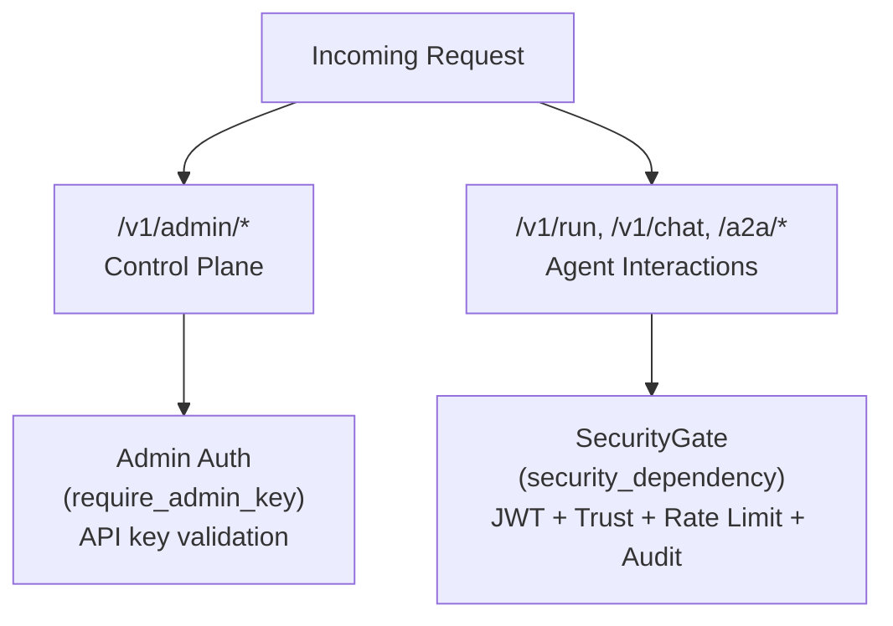
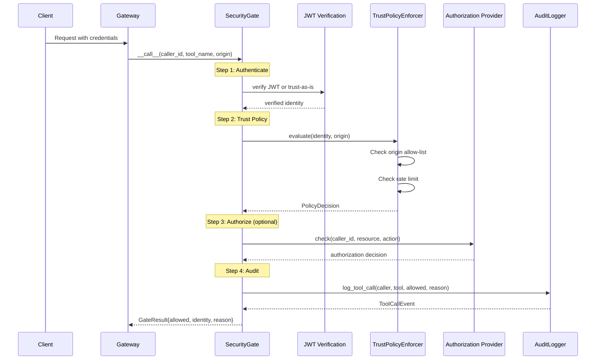
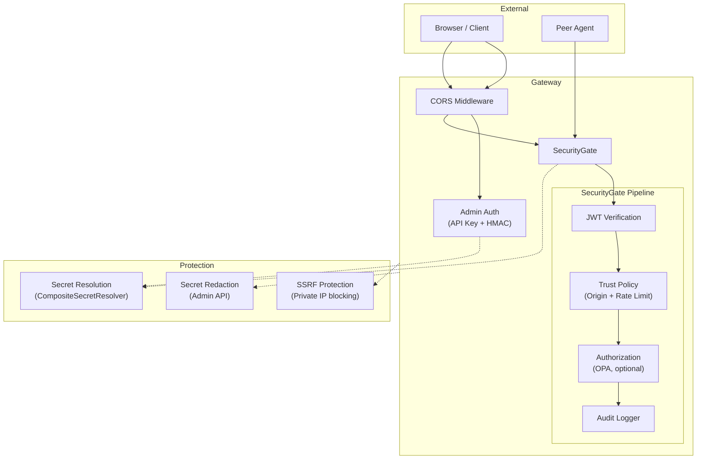

# Security

Forge AI implements defense-in-depth security with two distinct authentication layers, SSRF protection, secret management, CORS enforcement, and per-caller rate limiting.

## Authentication Layers

The system uses two separate authentication mechanisms for different route groups:



### Layer 1: Admin API Key Authentication

The `require_admin_key` FastAPI dependency protects all `/v1/admin/*` endpoints. It validates credentials provided via either header format:

- `Authorization: Bearer <key>`
- `X-API-Key: <key>`

**Validation flow:**

1. Check that `api_keys.enabled` is `true` in the configuration
2. Check that at least one key has been resolved from `SecretRef` entries
3. Extract the token from the request headers
4. Validate using **constant-time comparison** (`hmac.compare_digest`) against all resolved keys
5. Log failed attempts with the client's IP address

```python
# Constant-time comparison prevents timing attacks
def _validate_key(token: str) -> bool:
    token_bytes = token.encode("utf-8")
    for key in _resolved_keys:
        key_bytes = key.encode("utf-8")
        if hmac.compare_digest(token_bytes, key_bytes):
            return True
    return False
```

**HTTP responses:**

| Status | Condition |
|--------|-----------|
| 200 | Valid API key |
| 401 | Missing credentials or invalid key |
| 403 | API key auth not configured or no keys defined |

**Source:** `packages/forge-gateway/src/forge_gateway/auth.py`

### Layer 2: SecurityGate Pipeline

The `security_dependency` FastAPI dependency protects agent-facing routes. It wraps the `forge_security.SecurityGate` which composes four checks into a single pipeline:



**Source:** `packages/forge-security/src/forge_security/middleware.py`

#### Development Mode

When `security.agentweave.enabled` is `false` or the SecurityGate fails to initialize, the system enters development mode:

- All agent routes allow unauthenticated access
- A synthetic identity `"dev-anonymous"` is assigned to all requests
- A warning is logged at startup

## JWT Verification

When `security.jwt_secret` is configured, the `SecurityGate.authenticate()` method attempts to verify the caller's token as a JWT (HS256 algorithm):

| Outcome | Action |
|---------|--------|
| **Valid JWT** | Extract `sub` claim as the authenticated identity |
| **Invalid signature** (`InvalidSignatureError`) | **Deny** -- valid JWT structure but wrong secret |
| **Expired token** (`ExpiredSignatureError`) | **Deny** -- token has expired |
| **Other claim failure** (`InvalidTokenError`) | **Deny** -- invalid issuer, immature signature, etc. |
| **Not a JWT** (`DecodeError`) | **Fall through** -- treat raw value as plain identity (e.g., API key, SPIFFE ID) |

This design allows the system to accept both JWT tokens and plain identity strings (API keys, SPIFFE IDs) through the same authentication endpoint.

**Source:** `packages/forge-security/src/forge_security/middleware.py` (`_verify_jwt` method)

## SSRF Protection

The `validate_peer_endpoint()` function prevents Server-Side Request Forgery attacks when the gateway pings peer agents or interacts with configured endpoints:

```python
_PRIVATE_NETWORKS = [
    "10.0.0.0/8",       # RFC 1918
    "172.16.0.0/12",     # RFC 1918
    "192.168.0.0/16",    # RFC 1918
    "127.0.0.0/8",       # Loopback
    "169.254.0.0/16",    # Link-local
    "::1/128",           # IPv6 loopback
    "fc00::/7",          # IPv6 unique local
    "fe80::/10",         # IPv6 link-local
]
```

**Blocked targets:**

- All private IPv4 and IPv6 ranges listed above
- `localhost` hostname
- Hostnames ending in `.local`, `.internal`, or `.localhost`

For non-IP hostnames that do not match blocked patterns, the endpoint is allowed (DNS resolution happens later at connection time).

**Source:** `packages/forge-gateway/src/forge_gateway/auth.py` (`validate_peer_endpoint`)

## Secret Management

### Secret Resolution

Secrets are never stored in plaintext. All sensitive values use `SecretRef` objects that are resolved at runtime by the `CompositeSecretResolver`:

| Source | Resolver | Resolution Method |
|--------|----------|-------------------|
| `env` | `EnvSecretResolver` | `os.environ.get(ref.name)` |
| `k8s_secret` | `K8sSecretResolver` | Reads from Kubernetes secret volume mounts |

The `CompositeSecretResolver` supports registering additional resolvers for new secret sources.

**Source:** `packages/forge-config/src/forge_config/secret_resolver.py`

### Secret Redaction

The admin API (`GET /v1/admin/config`) recursively redacts all `SecretRef` values before returning configuration data. The redaction logic identifies `SecretRef` objects by checking for the presence of `source` and `name` fields where `source` is `"env"` or `"k8s_secret"`:

```python
def _redact_secrets(data: Any) -> None:
    if isinstance(data, dict):
        if "source" in data and "name" in data and data.get("source") in ("env", "k8s_secret"):
            data["name"] = "***REDACTED***"
            if "key" in data:
                data["key"] = "***REDACTED***"
            return
        for v in data.values():
            _redact_secrets(v)
    elif isinstance(data, list):
        for item in data:
            _redact_secrets(item)
```

**Source:** `packages/forge-gateway/src/forge_gateway/routes/admin.py` (`_redact_secrets`)

### Kubernetes Secret Injection

In the Helm chart, secrets defined in `values.secrets` are injected as a Kubernetes Secret and loaded via `envFrom.secretRef` into the agent container. This allows `SecretRef` objects with `source: env` to resolve from Kubernetes-managed secrets:

```yaml
# values.yaml
secrets:
  OPENAI_API_KEY: "sk-..."
  ANTHROPIC_API_KEY: "sk-ant-..."
```

**Source:** `deploy/helm/forge/templates/secret.yaml`, `deployment.yaml`

## CORS Configuration

CORS middleware is configured in the FastAPI application factory using the `security.allowed_origins` setting from `forge.yaml`:

```python
app.add_middleware(
    CORSMiddleware,
    allow_origins=origins,       # From config.security.allowed_origins
    allow_credentials=True,
    allow_methods=["*"],
    allow_headers=["*"],
)
```

When no origins are configured or the config cannot be loaded, the system falls back to `["*"]` with a warning. In production, configure explicit origins:

```yaml
security:
  allowed_origins:
    - "https://forge.example.com"
    - "https://admin.example.com"
```

**Source:** `packages/forge-gateway/src/forge_gateway/app.py` (`_resolve_cors_origins`)

## Rate Limiting

### Per-Caller Rate Limiting

The `SlidingWindowRateLimiter` enforces a per-identity request limit using an in-memory sliding window:

| Parameter | Default | Description |
|-----------|---------|-------------|
| `max_requests` | 60 | Maximum requests per window (configured via `security.rate_limit_rpm`) |
| `window_seconds` | 60.0 | Window duration in seconds |

**Implementation details:**

- Each identity string (e.g., SPIFFE ID, API key) has its own timestamp bucket
- Uses `time.monotonic` for clock stability (immune to wall-clock adjustments)
- Lock-free for single-threaded asyncio loops
- Expired timestamps are pruned on each check
- Returns `RateLimitResult` with `remaining` count and `reset_after` duration

**HTTP response when rate-limited:** `429 Too Many Requests` with a message including the retry-after duration.

**Source:** `packages/forge-security/src/forge_security/rate_limit.py`

### Rate Limit Integration

The rate limiter is integrated into the `TrustPolicyEnforcer`, which is invoked as step 2 of the SecurityGate pipeline. The enforcer checks:

1. **Origin allow-list** -- The request origin must match at least one pattern in `allowed_origins` (supports glob patterns via `fnmatch`)
2. **Rate limit** -- The caller identity must be within the configured RPM limit

**Source:** `packages/forge-security/src/forge_security/trust.py`

## Trust Policies

The `TrustPolicyEnforcer` supports two modes configured via `security.agentweave.trust_policy`:

| Policy | Behavior |
|--------|----------|
| `strict` | Full enforcement of origin checks, rate limits, and optional OPA authorization |
| `permissive` | Relaxed enforcement for development and testing environments |

The trust policy influences how the SecurityGate evaluates incoming requests at the `TrustPolicyEnforcer` stage of the pipeline.

## Security Architecture Summary


