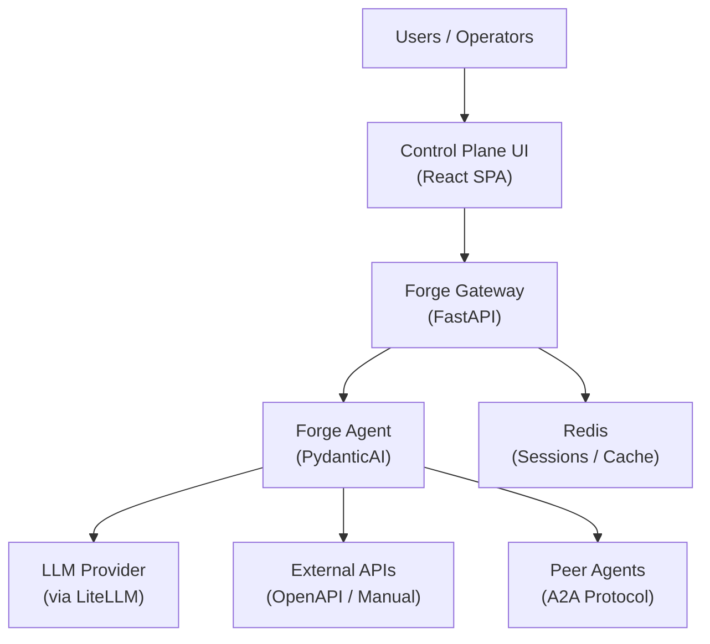
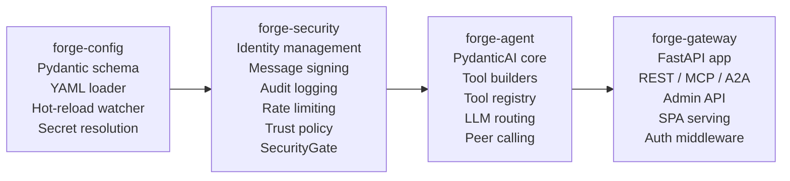
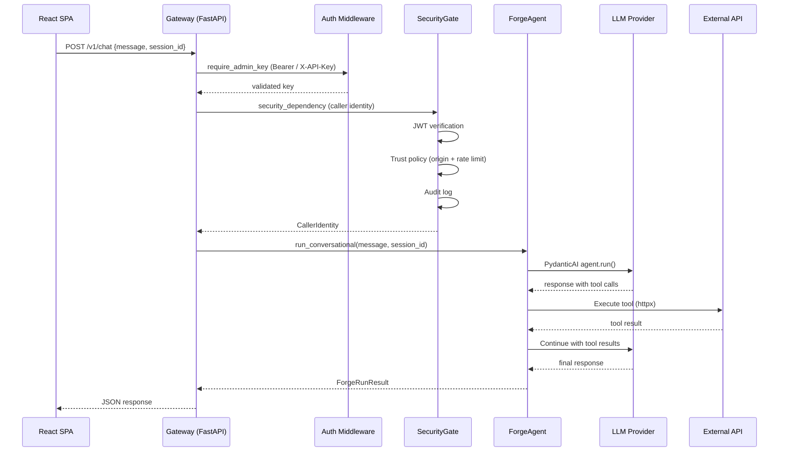
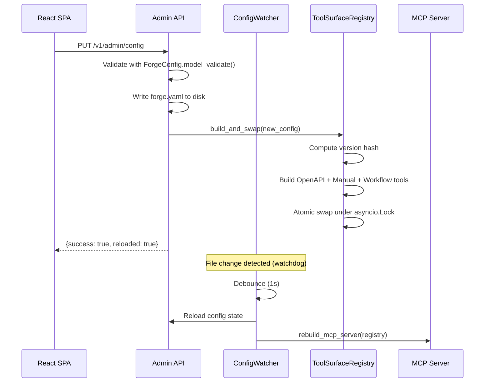

# System Design

## System Context

Forge AI sits between end users (via a React SPA control plane) and LLM providers, orchestrating tool-augmented AI agent interactions through a config-driven pipeline.

## Component Architecture

The system is structured as a **uv monorepo workspace** with four Python packages. Dependencies flow in a single direction, enforcing separation of concerns:

### Package Responsibilities

| Package | Role | Key Classes |
|---------|------|-------------|
| `forge-config` | Configuration schema, loading, and management | `ForgeConfig`, `ConfigWatcher`, `CompositeSecretResolver` |
| `forge-security` | Authentication, authorization, and audit | `SecurityGate`, `TrustPolicyEnforcer`, `SlidingWindowRateLimiter`, `AuditLogger` |
| `forge-agent` | AI agent orchestration and tool management | `ForgeAgent`, `ToolSurfaceRegistry`, `OpenAPIToolBuilder`, `ManualToolBuilder`, `WorkflowBuilder` |
| `forge-gateway` | HTTP gateway, routing, and UI serving | `create_app()`, `require_admin_key`, `security_dependency`, route modules |

## Request Flow

### Conversational Request (UI to Agent)

### Admin Config Update (Hot-Reload)

## Technology Stack

| Layer | Technology | Rationale |
|-------|-----------|-----------|
| **Language** | Python 3.12+ | Async-first ecosystem, PydanticAI native support |
| **Package Manager** | uv | Fast dependency resolution, workspace support for monorepo |
| **Agent Framework** | PydanticAI | Type-safe agent interactions, TestModel for testing without API calls |
| **LLM Routing** | LiteLLM | Multi-provider support (OpenAI, Anthropic, etc.), fallback chains |
| **HTTP Framework** | FastAPI | Async, OpenAPI generation, dependency injection |
| **Config Validation** | Pydantic v2 | Strict validation, JSON Schema export, model serialization |
| **Frontend** | React + Vite | SPA with content-hash asset fingerprinting |
| **Security** | AgentWeave | Identity, signing, audit, trust policy framework |
| **MCP** | FastMCP | Model Context Protocol tool surface builder |
| **HTTP Client** | httpx | Async HTTP client with connection pooling |
| **File Watching** | watchdog | Cross-platform filesystem event monitoring |
| **Container** | Docker (multi-stage) | Three-stage build targeting less than 200MB |
| **Orchestration** | Kubernetes + Helm | Deployment profiles (small/medium/large) with HPA |
| **Caching** | Redis | Session storage, caching (optional) |
| **Metrics** | Prometheus | /metrics endpoint via prometheus_client |
| **Testing** | pytest + pytest-asyncio | Async test support, PydanticAI TestModel |
| **Linting** | ruff | Fast linting and formatting, 100-char line length |
| **Type Checking** | mypy (strict) | Static type analysis across all packages |

## Design Patterns

### Config-Driven Architecture

The entire system is driven by a single `forge.yaml` configuration file. The `ForgeConfig` Pydantic model validates all settings at load time, and every subsystem reads its configuration from this central schema. This means:

- Tool surfaces are declared, not coded
- Agent personas are defined in YAML
- Security policies are configured, not hard-coded
- LLM routing is declarative

**Source:** `packages/forge-config/src/forge_config/schema.py` (ForgeConfig root model)

### Async Pipeline

All I/O operations use `asyncio`. The gateway, agent, tool builders, security gate, and rate limiter are all async-first. The `ForgeAgent.run_conversational()` and `run_structured()` methods are async, and tool execution uses `httpx.AsyncClient` for non-blocking HTTP calls.

**Source:** `packages/forge-agent/src/forge_agent/agent/core.py` (ForgeAgent)

### Tool Registry Hot-Swap

The `ToolSurfaceRegistry` maintains the current tool set and supports atomic replacement. When configuration changes:

1. A new version hash is computed from the config content
2. If the hash differs, new tools are built from all sources (OpenAPI, manual, workflow, peer)
3. The tool list is swapped atomically under an `asyncio.Lock`
4. The MCP server is rebuilt with updated tools

This allows zero-downtime tool surface updates without restarting the gateway.

**Source:** `packages/forge-agent/src/forge_agent/builder/registry.py` (ToolSurfaceRegistry.build_and_swap)

### SPA with API Gateway

The FastAPI gateway serves both the API and the React SPA:

- `/assets/*` -- Static files served by `StaticFiles` middleware
- Known SPA routes (`/`, `/config`, `/tools`, `/chat`, `/peers`, `/security`, `/guide`) -- Serve `index.html` with `Cache-Control: no-cache`
- API routes (`/v1/*`, `/health/*`, `/metrics`, `/mcp`) -- JSON API endpoints
- All other paths -- Return 404

**Source:** `packages/forge-gateway/src/forge_gateway/app.py` (create_app, spa_fallback)

### Separation of Auth Concerns

Authentication is split into two layers for different route groups:

1. **Admin auth** (`require_admin_key`) -- API key validation for the `/v1/admin/*` control plane endpoints. Uses constant-time comparison via `hmac.compare_digest`.

2. **Agent security** (`security_dependency`) -- Full SecurityGate pipeline for agent-facing routes. Supports JWT verification, trust policy enforcement, rate limiting, and audit logging.

**Source:** `packages/forge-gateway/src/forge_gateway/auth.py` and `security.py`

## Scalability

### Development (Small Profile)

- Single replica agent deployment
- In-process gateway (no separate pod)
- Embedded LiteLLM (in-process)
- Redis without persistence
- No autoscaling

### Production (Large Profile)

- 3 agent replicas (baseline)
- Separate gateway deployment (2 replicas)
- Dedicated LiteLLM service
- Redis with PVC persistence (5Gi)
- HPA autoscaling: 3-20 replicas at 60% CPU target
- Pod Disruption Budget: minimum 2 available
- ServiceMonitor for Prometheus scraping

The production profile enables the gateway as a separate deployment, allowing the API/SPA serving layer to scale independently from the agent compute layer.

**Source:** `deploy/helm/forge/values.yaml` (defaults), `values.prod.yaml` (production overrides)
